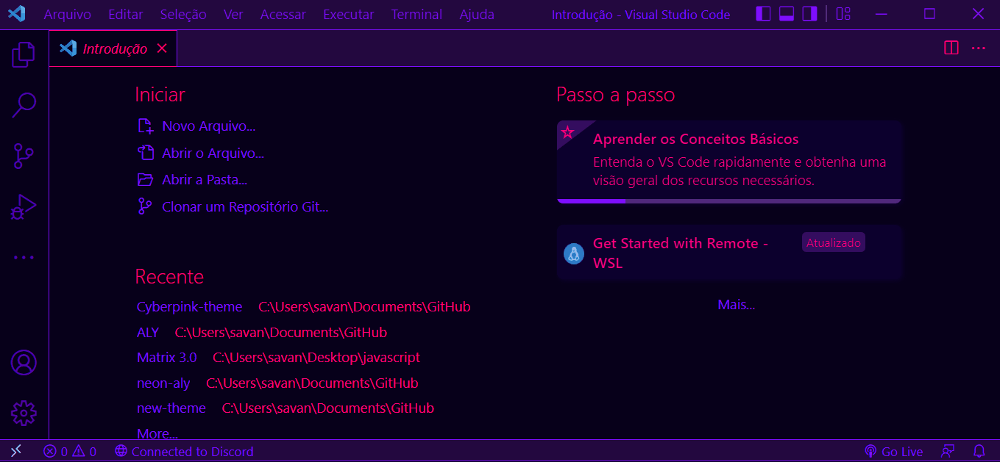

<h1 align="center">Hi 👋, I'm Chidubem Kingsley.</h1>

  
  

  
 
## 👨🏻‍💻 About Me: 

- 🌱 I’m currently learning **FULL STACK SOFTWARE ENGINEERING**

- 👨‍💻 Lover of Open Source contribution and Space Advocacy

- 💬 Ask me about **react,nodejs**

- 📧 📧 How to reach me **kingsleycaesar581@gmail.com**

##### . 🌱 I’m currently into block chain, with the use of Meta mask, Web3, and solidity
##### . 📫 I'm currently working on Artificial intelligence as a side Booster
##### . 🌱 Ask me anything about coding with typescript and node.js
##### . 💞️ I’m looking to collaborate on any project usig NodeJS, Typescript, Solidity, React, and block chain.

## Projects

Here are some of my noteworthy projects:

1. [alx
-system_engineering-devops](https://github.com/Chidubemkingsley/alx-system_engineering-devops.git)
   - Description: Brief description of the project.
      Learning bash, scripting, networking and web infra right now, been wanting to get on this.
   - Technologies Used: List of technologies used.
     Shell, Python, Puppet and Ruby

2. [ alx-low_level_programming
](https://github.com/Chidubemkingsley/alx-low_level_programming.git)
   - Description: Brief description of the project.
     Projects that entails the use of C and Python programming languages with the bash script.
   - Technologies Used: List of technologies used.

## Blog Posts

I occasionally write blog posts on topics such as [Your Blog Topics]. Check out some of my recent posts:

- [How to make a lot of money as a developer](https://medium.com/@kingsleycaesar581/maximizing-your-coding-skills-how-to-make-money-as-a-software-developer-f696f9ba796e)
- [How to Make Money With SaaS Affiliate Marketing: 7 Simple Tips](https://medium.com/@kingsleycaesar581/how-to-make-money-with-saas-affiliate-marketing-7-simple-tips-79caff4ca9e5)

## GitHub Stats

## Let's Connect

- LinkedIn: [Your LinkedIn Profile](www.linkedin.com/in/chidubem-rubeluchukwuisi-b78599156)
- Twitter: [Your Twitter Profile](https://twitter.com/KingsleyCaesar1)
- Portfolio: [Your Portfolio Website](Link)

## 🧰 Languages and Tools:

  
  
  
  
  
  
  
  
  
  
     
  
    
    
    
    
      
       
  
  
    
      
        
  
    
  
  
  
  
  
  

Feel free to reach out! I'm always open to interesting conversations and collaborations.

Thanks for stopping by! 😊

